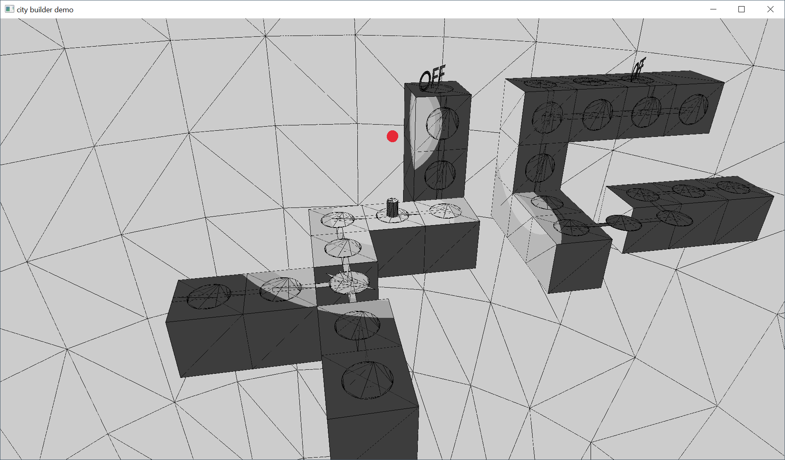

# City Builder Game
## Overview
A simple turn-based puzzle game based on the 2016 video game 'Lara Croft Go' (https://store.steampowered.com/app/540840/Lara_Croft_GO/)

This was a weekend project to make a game using an entity-component system (entt) that has since evolved into porting the renderer to raylib.

The project was forked from CityBuilderGame (https://github.com/PhiGei2000/CityBuilderGame) and still takes inspiration.

### Features
- [x] GUI
- [x] Turn-based movement
- [x] Example levels (currently the first 5 from Lara Croft Go)
- [x] Level switches
- [ ] Character animations
- [ ] Traps / Falling
- [ ] Level dressing
- [ ] Directional Lighting
- [ ] Fog
- [ ] Volumetric shadows

---
## Getting started
### Check the requirements
Requirements:
- CMake 3.22.1 and above
- C++ 20
- OpenGL 4.5

Packages (only on Linux):
- [stb image](https://github.com/nothings/stb/blob/master/stb_image.h)
- [entt](https://github.com/skypjack/entt)
- [pugixml](https://github.com/zeux/pugixml)
- [raylib](https://github.com/raysan5/raylib)

### Clone and build
**1. Clone the repository**

    git clone --recursive https://github.com/x1nixmzeng/CityBuildingGame.git

the `--recursive` option is only needed on windows to download the libraries from github.

**2. Change your current directory to the downloaded project**

    cd ./CityBuilderGame

**3. Run CMake to build the project**

    cmake --build ./build

After that keep sure you link or copy the res directory to the build directory

    cp -r ./res ./build/

or to create a symbolic link

    cd ./build && ln -s ../res res
**3. Run build script (Linux)**

    bash ./build.sh

**4. Start the game**

    ./cityBuilderGame

## Controls

| Button(s) | Description |
| --- | ---|
| LEFT/RIGHT/UP/DOWN | Move |
| SPACE | Interact |
| ESC | Pause menu |
| (Hold) C| Free camera |
| WASD | Move free camera |
| 1/2/3/4 | Toggle the light |
| F1 | Toggle debug panel |
| F2 | Toggle control panel |

## Issues and questions
Feel free to report issues and questions to the [issues section](https://github.com/x1nixmzeng/CityBuilderGame/issues).

## License
This code is licensed under the [GNU GLP license](LICENSE)
