# Tile Naming

Although the game is in 3D, the camera is fixed and only shows up to three faces of a cube.

All of these faces have between 1 and 4 directions for the player to travel. Each direction is named *based on* the cardinal directions (North, East, South, West).

There are 15 possible unique variations for each tile:

- N
- NE
- NS
- NW
- NES
- NEW
- NSW
- E
- ES
- EW
- ESW
- S
- SW
- W
- NESW

Other variations include cracking, cracked, and saw paths are to be confirmed

## Thumbnails

(Note these thumbnail captures are generated by the runtime)

- [Ground Tiles](#ground-tiles)
- [Front Tiles](#front-tiles)
- [Side Tiles](#side-tiles)

### Ground Tiles

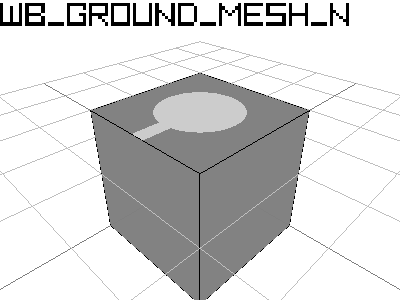
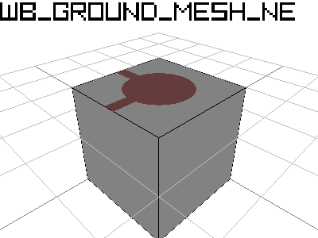

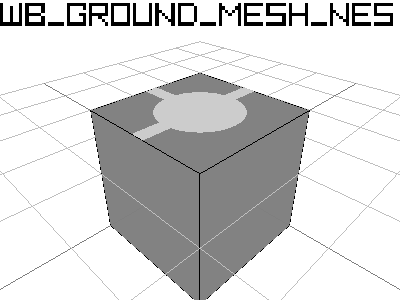
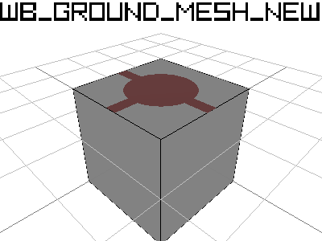

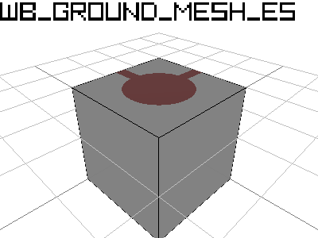

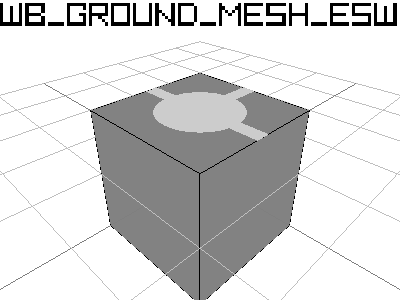
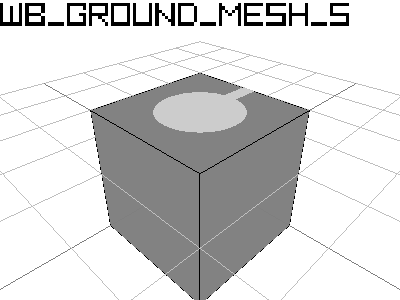
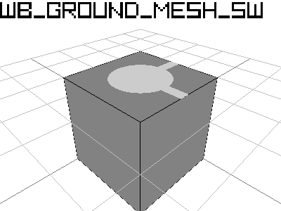

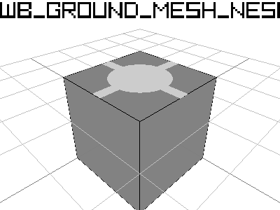

### Front Tiles

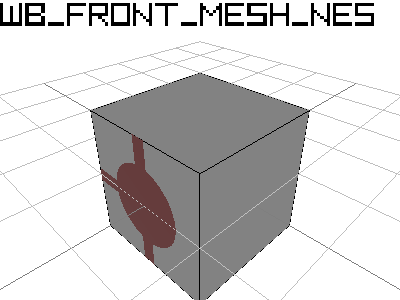

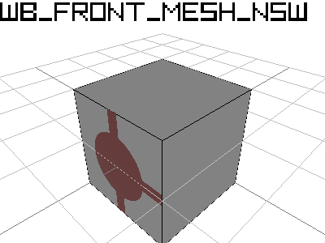

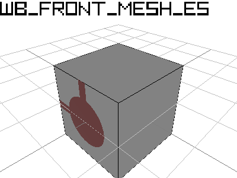

### Side Tiles

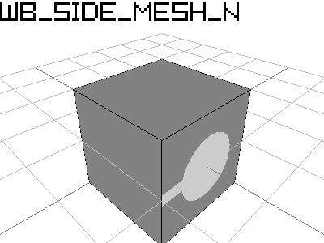

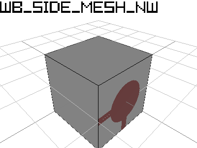
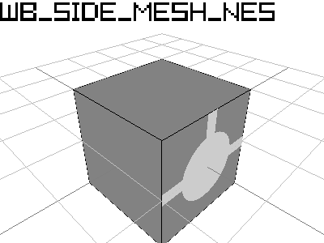

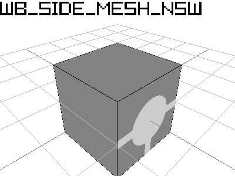

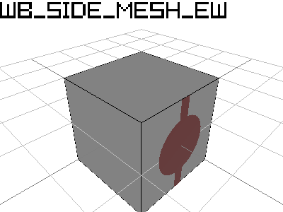

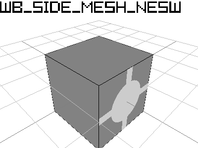
